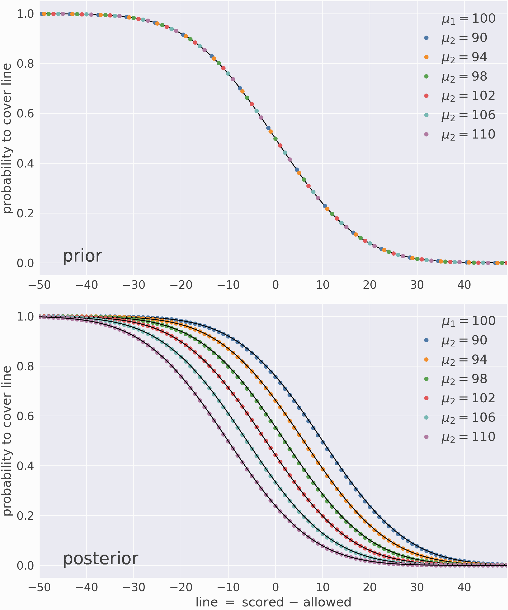
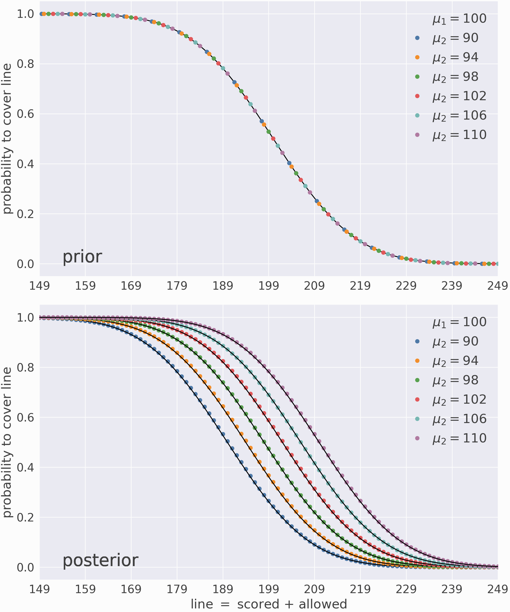

Tests
=====

``elora`` has a standard set of unit tests, whose current CI status is:

.. image:: https://travis-ci.org/morelandjs/elora.svg?branch=master
    :target: https://travis-ci.org/morelandjs/elora

The unit tests do not check the physical accuracy of the model which is difficult to verify automatically.
Rather, this page shows a number of statistical tests which can be used to assess the model manually.

Toy model
---------

Consider a fictitious "sports league" of seven teams. Each team samples points from a `normal distribution <https://en.wikipedia.org/wiki/Normal_distribution>`_ `X_\text{team} \sim \mathcal{N}(\mu, \sigma^2)` where `\sigma=10` is a fixed standard deviation and `\mu_\text{team}` is one of seven numbers

.. math::
   \mu_\text{team} \in \{90, 94, 98, 100, 102, 106, 110\}

specifying the team's mean expected score. I simulate a series of games between the teams by sampling pairs `(\mu_{\text{team}_1}, \mu_{\text{team}_2})` with replacement from the above values. Then, for each game and team, I sample a normal random variable `\mathcal{N}(\mu_\text{team}, \sigma^2)` and record the result, producing a tuple

.. math::
   (\text{time}, \text{team}_1, \text{score}_1, \text{team}_2, \text{score}_2),

where time is a np.datetime64 object recording the time of the comparison, `\text{team}_1` and `\text{team}_2` are strings labeling each team by their `\mu`-values, and `\text{score}_1` and `\text{score}_2` are random floats. This process is repeated `\mathcal{O}(10^6)` times to simulate a large number of games played between the teams.

Point spread validation
-----------------------

I then calculate the score difference or `\text{spread} \equiv \text{score}_1 - \text{score}_2` for each game to form a list of comparisons `(\text{time}, \text{team}_1, \text{team}_2, \text{spread})` and use these comparisons to train the Elo regressor algorithm: ::

   scale = np.sqrt(2*10**2) # std dev for difference of two normal random variables
   model = Elora(1e-4, scale=scale, commutes=False)
   model.fit(times, teams1, teams2, spreads)

Now that the model is trained, I can predict the probability that various matchups cover each value of the line, i.e\. `P(\text{spread} > \text{line})`. Since the underlying distributions are known, I can validate these predictions using their analytic results.

   The top panel validates the model's prior predictions (before the first game), and the bottom panel validates its posterior predictions (after the last game). The colored dots are model predictions and the black lines are their target values.

Point total validation
----------------------

   This figure is the same as above but for predictions of each game's point total.
